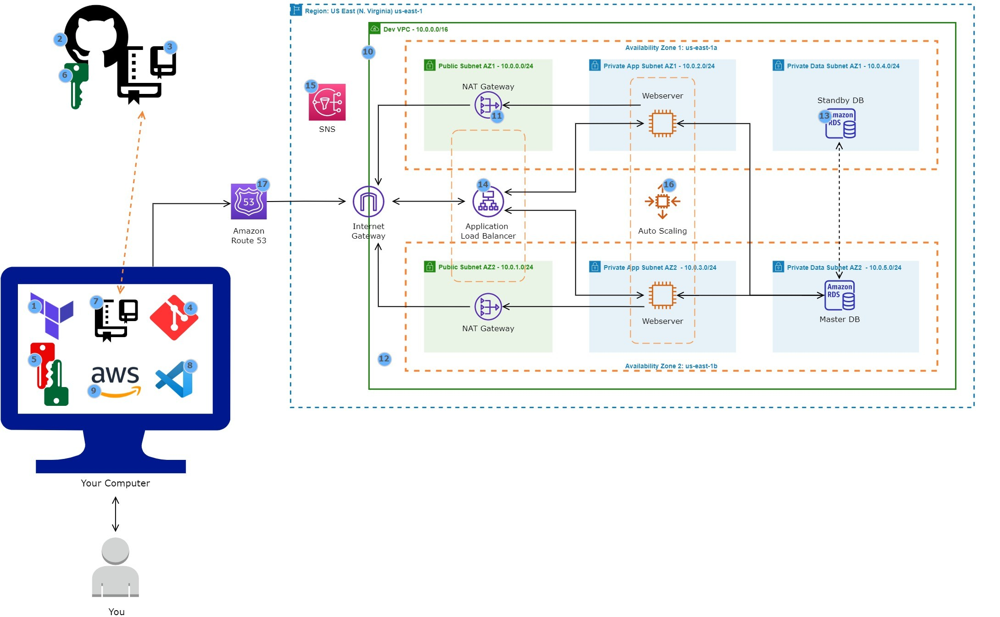

---

# Dynamic Website Deployment on AWS Using Terraform

## Project Overview

This project involves hosting a dynamic website on Amazon Web Services (AWS) as part of a DevOps initiative, utilizing Terraform for the provisioning of infrastructure. A GitHub repository containing the reference diagram and deployment scripts has been created.

---
## Architecture and Configuration

### **Networking and Security**

1. **Virtual Private Cloud (VPC):** The infrastructure includes a configured VPC with both public and private subnets spanning two availability zones.


---
2. **Internet Gateway:** An Internet Gateway has been deployed to facilitate connectivity between the VPC instances and the broader internet.

---
3. **Security Groups:** Security Groups have been established to function as a network firewall mechanism.


---
4. **Availability Zones:** The architecture leverages two Availability Zones to enhance system reliability and fault tolerance.
5. **Public Subnets:** Public subnets are utilized for critical infrastructure components, including the NAT Gateway and Application Load Balancer.
6. **Web Server Security:** Web servers, implemented as EC2 instances, are positioned within private subnets to enhance security.
7. **Internet Access for Private Subnets:** Instances located in both the private application and data subnets are permitted internet access via the NAT Gateway.


---
### **Compute and Scalability**

8. **Website Hosting:** The website is hosted on EC2 instances.
9. **Load Balancing:** An Application Load Balancer, along with a target group, has been employed to distribute web traffic evenly to an Auto Scaling Group of EC2 instances across multiple Availability Zones.


---
10. **Auto Scaling:** An Auto Scaling Group has been utilized to automatically manage EC2 instances, thereby ensuring website availability, scalability, fault tolerance, and elasticity.


---
### **Database Management**

11. **Amazon RDS:** A managed relational database service (Amazon RDS) is used to handle application data, ensuring high availability, security, and automatic backups.

---
### **Security and Monitoring**

12. **Monitoring and Alerts:** Simple Notification Service (SNS) has been configured to provide alerts regarding activities within the Auto Scaling Group.

---
### **Domain Name**
13. **Secure Communications:** Application communications are secured using AWS Certificate Manager.
14. **Domain Registration and DNS Configuration:** The domain name has been registered, and a DNS record has been established using Amazon Route 53.


---
### **Outputs and Variables**


## **Terraform Apply**


---
## Deployment Instructions

1. Clone the GitHub repository:
   ```sh
   git clone <repository-url>
   cd <project-directory>
   ```
2. Deploy the Terraform scripts to set up the infrastructure.
3. Configure DNS settings in Route 53 to point to the ALB.
4. Upload the application code to S3 and deploy it to EC2 instances.
5. Validate the deployment by accessing the website using the registered domain name.

## Monitoring and Alerts

- The Auto Scaling Group is configured with SNS to send notifications on instance scaling events.
- AWS CloudWatch can be used for monitoring instance performance and logging application errors.

## Conclusion

This project demonstrates a highly available, scalable, and secure architecture for hosting a dynamic website on AWS using best DevOps practices. By leveraging AWS services, we ensure seamless scalability, security, and efficient resource management.


